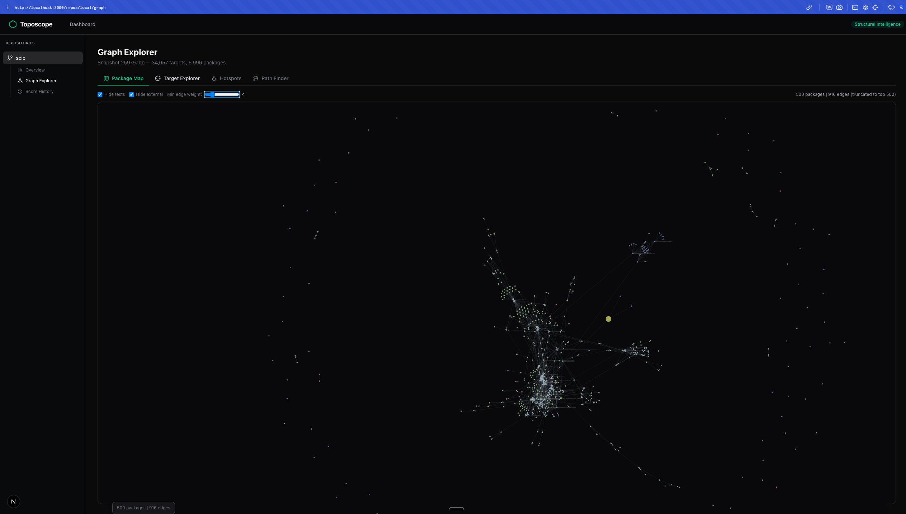
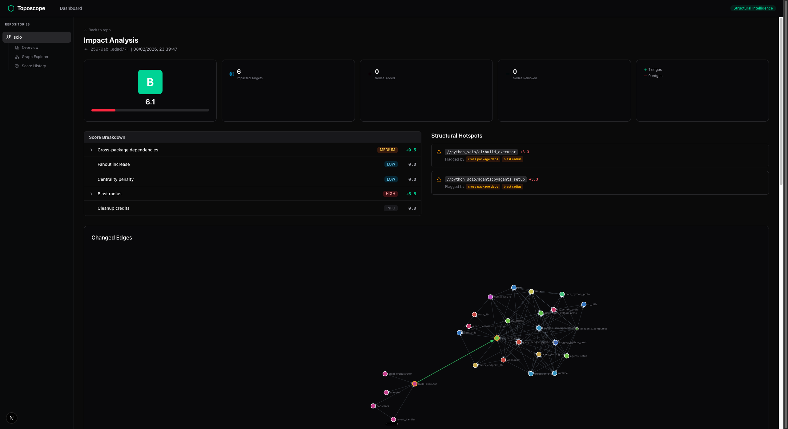

[](https://github.com/toposcope/toposcope/actions/workflows/ci.yml)
[](https://goreportcard.com/report/github.com/toposcope/toposcope)
[](LICENSE)

# Toposcope

**Structural intelligence for Bazel monorepos.**

Toposcope extracts, scores, and visualizes the dependency graph of your Bazel workspace. It catches structural regressions — unnecessary cross-package dependencies, fanout explosions, centrality bottlenecks — before they compound into build health debt.


## Why

Large Bazel monorepos accumulate structural debt silently. A single `deps = [...]` line can transitively pull thousands of targets into a build, slow down CI, and create invisible coupling between teams. Code review catches logic bugs but rarely catches structural ones.

Toposcope makes structural changes visible:

- **Score every change** against 5 evidence-backed metrics
- **Visualize the dependency graph** at package and target level
- **Find shortest paths** between any two targets to understand "why does A depend on B?"
- **Track structural health** over time on your main branch
- **Surface hotspots** — the targets flagged by multiple metrics that need attention

## Quickstart

### Prerequisites

- Go 1.22+
- Node.js 20+ and pnpm
- A Bazel workspace (with `MODULE.bazel` or `WORKSPACE`)
- [bazel-diff](https://github.com/Tinder/bazel-diff) JAR (optional, improves change detection)

### Install

```bash
git clone https://github.com/toposcope/toposcope.git
cd toposcope
go build -o bin/toposcope ./cmd/toposcope
```

### Extract a snapshot

```bash
bin/toposcope snapshot --repo-path /path/to/your/bazel/repo
```

This runs `bazel query` to extract every target and dependency edge, then caches the result at `~/.cache/toposcope/<repo>/snapshots/<sha>.json`.

### Explore the graph

```bash
# Terminal 1 — start the API server
bin/toposcope ui --repo-path /path/to/your/bazel/repo

# Terminal 2 — start the web UI
cd web && pnpm install && NEXT_PUBLIC_API_MODE=local pnpm dev
```

Open [http://localhost:3000](http://localhost:3000).



### Score a change

Compare any two commits to get a structural health score:

```bash
bin/toposcope score --base master --head HEAD --repo-path /path/to/your/bazel/repo
```

```
Toposcope: Grade B — Score 6.1

Analyzed: 0 added nodes / 0 removed nodes / 1 added edges / 0 removed edges

Findings:
  (+0.5) Cross-package dependencies — Intra-boundary cross-package edge:
         //python_scio/ci:build_executor -> //python_scio/agents:pyagents_setup

  (+5.6) Blast radius — Affected node //python_scio/agents:pyagents_setup has 4 reverse deps
         Affected node //python_scio/ci:build_executor has 2 reverse deps

Hotspots:
  * //python_scio/ci:build_executor — Flagged by 2 metrics
  * //python_scio/agents:pyagents_setup — Flagged by 2 metrics
```

Scores are saved automatically and appear in the web UI under the repo overview.

## Features

### Graph Explorer

Four views of your dependency graph:

| Tab | Description |
|-----|-------------|
| **Package Map** | Force-directed graph of packages, sized by target count. Filter tests, externals, and minimum edge weight. Click to drill into a package's targets. |
| **Target Explorer** | Ego-graph around any target. Search by name, adjust depth (1-5), toggle deps/rdeps/both. |
| **Hotspots** | Packages ranked by in-degree — the most depended-upon packages in your repo. |
| **Path Finder** | Shortest path between any two targets. Answers "why does A depend on B?" with a layered DAG visualization. |

### Scoring Metrics

Every `toposcope score` run evaluates 5 metrics:

| Metric | Key | What it catches |
|--------|-----|-----------------|
| **Cross-package deps** | `cross_package_deps` | New edges crossing package boundaries, especially across architectural layers |
| **Fanout increase** | `fanout_increase` | Targets accumulating too many outgoing dependencies |
| **Centrality penalty** | `centrality_penalty` | New dependencies on already-high-in-degree targets (bottleneck coupling) |
| **Blast radius** | `blast_radius` | Transitive downstream impact of changed targets |
| **Cleanup credits** | `credits` | Negative score for improvements — removing cross-boundary edges, reducing fanout |

Grades: **A** (0-3) | **B** (3-7) | **C** (7-14) | **D** (14-24) | **F** (24+)

### Impact Analysis

Score results include:

- Grade and total score with per-metric breakdown
- Structural hotspots (targets flagged by 2+ metrics)
- Suggested actions with confidence levels
- Changed edges graph with added/removed edges highlighted
- Transitive impact visualization — toggle between "New Deps", "Blast Radius", or "Both" with adjustable depth


### Score History

Track structural health trends over time on your main branch.



## CLI Reference

```
toposcope snapshot   Extract a graph snapshot from a Bazel workspace
toposcope diff       Compare two snapshots and compute a structural delta
toposcope score      Full pipeline: extraction, delta, scoring, rendering
toposcope ui         Start a local API server for the web UI
```

### `toposcope score`

```
Flags:
  --base string             Base git ref (required)
  --head string             Head git ref (default "HEAD")
  --repo-path string        Path to Bazel workspace root
  --output string           Output format: text or json (default "text")
  --bazel-path string       Path to bazel/bazelisk binary
  --bazelrc string          Path to .bazelrc file
  --cquery                  Use cquery instead of query
  --bazel-diff-jar string   Path to bazel-diff.jar for change detection
```

### `toposcope ui`

```
Flags:
  --repo-path string   Path to Bazel workspace root
  --port string        Port to serve on (default "7700")
```

## Configuration

Create `.toposcope/config.yaml` in your repository root:

```yaml
scoring:
  boundaries:
    - app
    - lib
    - platform
    - proto
  weights: {}

extraction:
  timeout: 600
  bazel_path: bazelisk
  use_cquery: false
  bazel_diff_jar: /path/to/bazel-diff.jar
```

## Architecture

```
cmd/
  toposcope/       CLI: snapshot, diff, score, ui
  toposcoped/      Hosted server: webhooks, async processing

pkg/
  graph/           Core types: Snapshot, Node, Edge, Delta
  scoring/         Scoring engine + 5 metrics
  extract/         Bazel query parser, bazel-diff integration
  config/          Configuration and cache paths
  surface/         Output renderers: terminal, JSON, GitHub Check Run

internal/
  webhook/         GitHub App webhook handler
  ingestion/       Async pipeline: extract -> delta -> score -> store
  surface/         GitHub Check Run publisher

web/               Next.js 15 web UI
  src/app/         Pages: dashboard, repo overview, graph explorer, score detail
  src/components/  Graph visualizations (D3), scoring components
  src/lib/api/     API clients: local, hosted, mock

infra/             GCP Terraform: Cloud Run, Cloud SQL, GCS, Cloud Tasks
```

## Hosted Deployment

Toposcope can run as a hosted service with GitHub App integration. The infrastructure is defined in `infra/` as Terraform for GCP:

- **Cloud Run** — serves the API and processes webhooks
- **Cloud SQL** — PostgreSQL for repos, scores, and baselines
- **GCS** — snapshot and delta JSON storage
- **Cloud Tasks** — async extraction queue

### Running on merges to master

1. Install the GitHub App on your repository
2. Toposcope receives `push` events on your default branch
3. Each merge triggers: snapshot extraction, delta computation, scoring
4. Results are stored and appear in the dashboard with trend tracking

### PR integration

Once master scoring is stable, enable PR analysis:

1. Toposcope receives `pull_request` events (open, synchronize)
2. Scores the PR diff against the latest master baseline
3. Posts results as a GitHub Check Run with pass/fail based on grade

## Development

```bash
# Build the CLI
go build -o bin/toposcope ./cmd/toposcope

# Run tests
go test ./...

# Start the web UI in dev mode
cd web && pnpm install && pnpm dev

# Type-check the web UI
cd web && pnpm tsc --noEmit
```

## License

MIT
